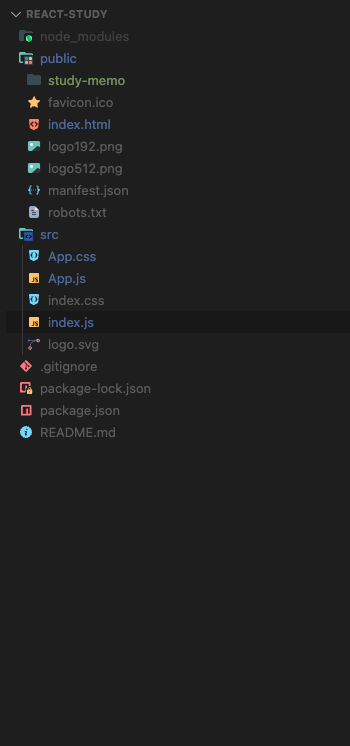

```
function Welcome(props) { return <h1>Hello, {props.name}</h1>; }
```

- 웰컴이 컴포넌트이다.(함수와 비슷)

- React는 선언적 접근 방식을 사용

- 리액트 환경 구축

```
kon@konui-MacBookAir  ~  node -v. //버전 체크
v22.2.0
kon@konui-MacBookAir  ~  npm -v. //버전 체크
10.7.0
```

```
sudo npx create-react-app react-study. = 이거 해야 리엑트 프로젝트 깔림
```

```
sudo chmod -R 777 . = 폴더 권한 주기
```

```
sudo npm install =커밋받고 처음해야 노드 모듈 깔 수 있음
```

```
sudo npm start = 리액트 서버 시작 로컬 3030
```

---



- 파일 정리
