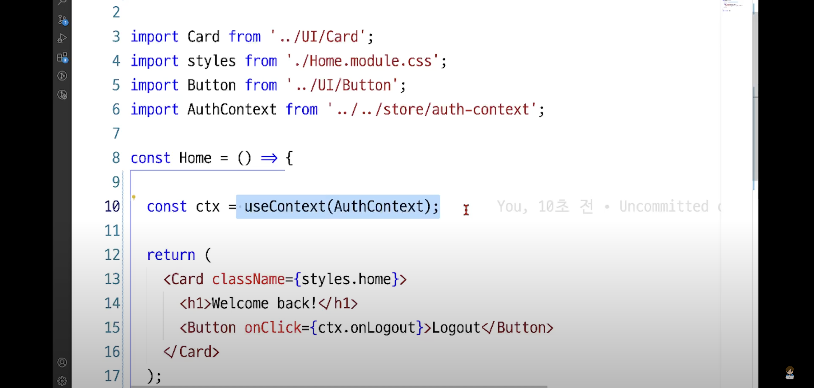

지금 방식으로 하면 컨슈머 안써도 됨   
//선언하는 곳에서 선언 store/auth-context.js   
```
import React from "react";
// 로그인 관련 상태 데이터들을 중앙 집중 관리하는 파일
// 컨텍스트는 데이터 중앙 저장소 => 생성 시, 관리할 기본 데이터를 명시
// 데이터 값은 타입 기본값을 명시
const AuthContext = React.createContext({
  isLoggedIn: false,
  onLogout: () => {}, //타입 기본 데이터를 넣으면 에디터에서 자동완성이 뜸~!
});

export default AuthContext;
```

사용 하는 곳에서 import (home.js)

```
import React, { useContext } from "react";

import Card from "../UI/Card";
import styles from "./Home.module.css";
import Button from "../UI/Button";

import AuthContext from "../../store/auth-context";

const Home = () => {
  const { onLogout } = useContext(AuthContext);
  // console.log("ctx:", ctx);
  return (
    <Card className={styles.home}>
      <h1>Welcome back!</h1>
      <Button onClick={onLogout}>Logout</Button>
    </Card>
  );
};

export default Home;

```
+navigation.js

useContext(AuthContext);선언

 { isLoggedIn, onLogout } 쪼개서 받는다~!

```
const { isLoggedIn, onLogout } = useContext(AuthContext);

  return (
    <nav className={styles.nav}>
      <ul>{isLoggedIn ? loginPage(onLogout) : anonymousPage}</ul>
    </nav>
  );
};

export default Navigation;

```
